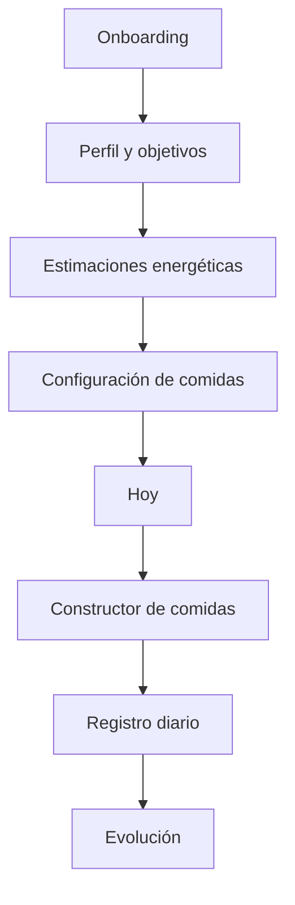

# Arquitectura funcional y técnica

## 1. Decisión de producto

NutriTrack será una SPA mobile-first, sin servidor en la primera versión. El usuario configura su perfil, define objetivos, arma comidas, registra hábitos y consulta su evolución desde el mismo dispositivo.

La navegación principal se organiza en cinco áreas:

| Área | Responsabilidad |
|---|---|
| Hoy | Resumen diario, progreso, agua, pasos y comidas |
| Comidas | Constructor, registro, favoritos y alternativas |
| Actividad | Entrenamiento, pasos, sueño, hambre y saciedad |
| Evolución | Peso, promedios, consistencia y gráficos |
| Perfil | Datos personales, objetivos, alimentos y preferencias |

## 2. Flujo principal



## 3. Capas de la aplicación

```text
UI / vistas
  ├── Onboarding
  ├── Dashboard Hoy
  ├── Constructor de comidas
  ├── Actividad y hábitos
  ├── Evolución
  └── Perfil y configuración

Estado de aplicación
  ├── profile
  ├── goals
  ├── meals
  ├── dailyLogs
  ├── foods
  └── preferences

Dominio
  ├── cálculo de IMC
  ├── Mifflin-St Jeor
  ├── TDEE
  ├── objetivos de calorías y macros
  ├── totales de comidas
  └── promedios y consistencia

Persistencia
  ├── localStorage versionado
  ├── exportación JSON
  └── importación JSON validada
```

## 4. Modelo de datos inicial

```ts
type UserProfile = {
  name?: string;
  age: number;
  sex: 'male' | 'female' | 'other';
  heightCm: number;
  currentWeightKg: number;
  targetWeightKg?: number;
  waistCm?: number;
  bodyFatPct?: number;
  muscleMassKg?: number;
  activityLevel: 'sedentary' | 'light' | 'moderate' | 'high';
  primaryGoal: 'fat_loss' | 'weight_loss' | 'maintenance' | 'recomposition' | 'muscle_gain';
};

type NutritionGoals = {
  calories: number;
  proteinGrams: number;
  carbsGrams: number;
  fatGrams: number;
  fiberGrams: number;
  waterMl: number;
  mealsPerDay: number;
};

type Food = {
  id: string;
  name: string;
  group: 'protein' | 'carb' | 'legume' | 'vegetable' | 'fat' | 'fruit' | 'extra';
  servingLabel: string;
  servingGrams?: number;
  calories: number;
  protein: number;
  carbs: number;
  fat: number;
  fiber: number;
  isCustom?: boolean;
};

type Meal = {
  id: string;
  date: string;
  type: 'breakfast' | 'lunch' | 'snack' | 'dinner' | 'other';
  items: Array<{ foodId: string; servings: number }>;
  hungerBefore?: 1 | 2 | 3 | 4 | 5;
  satietyAfter?: 1 | 2 | 3 | 4 | 5;
};

type DailyLog = {
  date: string;
  meals: string[];
  waterMl: number;
  steps: number;
  sleepHours?: number;
  training?: { type: string; minutes: number; intensity?: string };
  weightKg?: number;
  hungerAvg?: number;
  anxiety?: number;
  mood?: number;
};
```

## 5. Reglas de cálculo

- IMC: `pesoKg / (alturaM * alturaM)`.
- BMR: Mifflin-St Jeor según sexo seleccionado.
- TDEE: `BMR × factor de actividad`.
- Calorías objetivo: TDEE ajustado por objetivo; siempre editable por el usuario.
- Proteína: objetivo configurable; la aplicación mostrará el criterio usado y permitirá modificarlo.
- Todos los resultados calculados deben mostrar que son estimaciones.
- No se emitirán diagnósticos, indicaciones médicas ni alertas clínicas.

## 6. Estados importantes

- `firstVisit`: mostrar onboarding.
- `profileIncomplete`: permitir continuar sin bloquear la exploración.
- `todayEmpty`: mostrar CTA para registrar la primera comida.
- `goalExceeded`: feedback neutro y opción de revisar el día.
- `noHistory`: estado vacío en Evolución.
- `importError`: rechazar archivo sin sobrescribir datos existentes.

## 7. Decisiones técnicas para V1

- HTML semántico, CSS modular y JavaScript moderno sin framework para reducir complejidad inicial.
- Datos nutricionales en `src/data/foods.json`.
- Estado central en `src/state/store.js`.
- Cálculos puros y testeables en `src/domain/calculations.js`.
- Adaptador de persistencia aislado en `src/storage/storage.js`.
- Gráficos con SVG o una dependencia liviana solo cuando el MVP esté validado.
- GitHub Pages mediante GitHub Actions.

